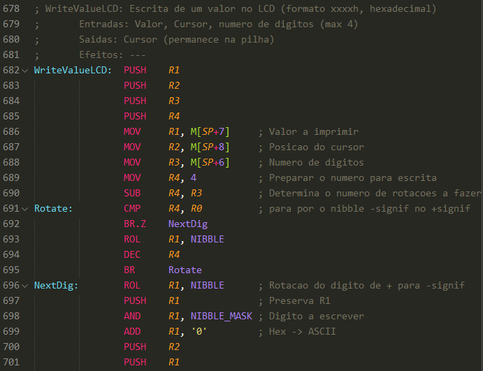

# P3 Assembly
## A *Sublime Text 3* assembly language syntax

__*Sidenote*__: Designed to accomodate the syntax of the P3 processor's assembly
language, this theme is in no way a finished product. Feel free to contribute
to the project or submit an issue detailing a problem with the project or what
have you.

Still on a tangent, a color theme is __*not*__ supplied with this package. It is
purely a syntax for the P3 assembly language.

## The P3 Processor

The P3 is a 16-bit word architecture processor used at Lisbon University's 
[Superior Technical Institute][1] ([Instituto Superior Técnico da Universidade 
de Lisboa][2], IST@UL) in the Introduction to Computer Architecture subject of 
the Computer Science and Engineering BSc degree.

In practice, during the course's subject, a project is tailored for the first
year's first semester students (freshmen, hopefully). Usually, or at least thus
far, the project consists of creating a [well-known game][3] (or should I say
recreating) using the P3 processor simulator, a Java application capable of
simulating the assembled code to be loaded onto the processor itself on a later
stage, during a demo or for testing purposes, since the simulator's.. not very
feasible or reliable, if I may.

## Some specifications

A few of the processor's specifications are listed below.

__1. Registers__

  - `R0 - R7` - General use registers (`R0` holds the constant `0`)
  - `PC` - The program counter
  - `SP` - The stack pointer
  - `RE` - State register with 5 state bits, EZCNO, where
    - `E`: Enable interrupts
    - `Z`: Zero
    - `C`: Carry
    - `N`: Negative
    - `O`: Overflow 

__2. Memory__

  - Address space: 64K words
  - Word size: 16 bits

__3. I/O__

  - I/O Addresses: Memory Mapped I/O from `FF00h` upward
  - Text Window: `FFFCh - FFFFh`
  - Interruptors (or switches): `FFF9h`
  - LEDs: `FFF8h`
  - LCD: `FFF4h - FFF5h`
  - 7-Segment display: `FFF0h - FFF3h`
  - Timer: `FFF6h - FFF7h`

__4. Interrupts__

  - Interrupt mask: `FFFAh`
  - Interrupt vector base: `FE00h`

More information can be found in the P3 processor simulator manual [here][4] (in
 portuguese).

## Example Screenshot (using Monokai)

[1]: https://tecnico.ulisboa.pt/en/ "Técnico Lisboa"
[2]: https://tecnico.ulisboa.pt/pt/ "Técnico Lisboa"
[3]: https://github.com/ist181045/iac1415-tron "IAC Project - 14'15"
[4]: https://fenix.tecnico.ulisboa.pt/downloadFile/1970943312270159/Manual_P3.pdf "Manual do Simulador do P3"
